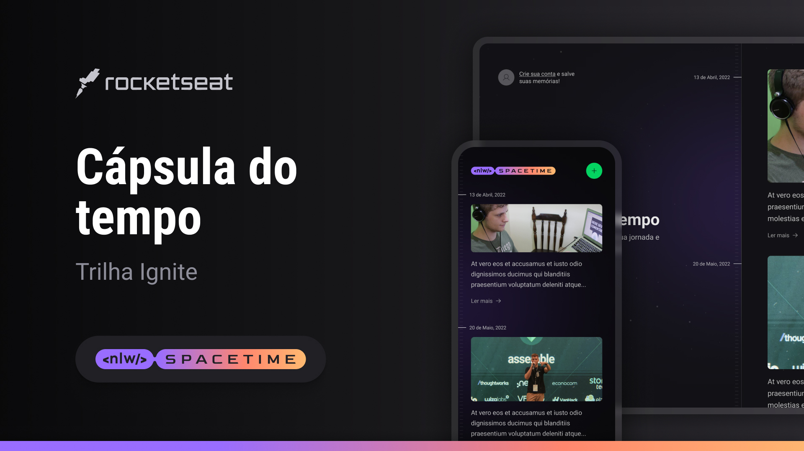

<h1 align="center">Nlw Spacetime</h1>
<p align="center">
  <a href="#-tecnologias">Tecnologias</a>&nbsp;&nbsp;&nbsp;|&nbsp;&nbsp;&nbsp;
  <a href="#-projeto">Projeto</a>
</p>


<p align="center">
  
</p>

## 🚀 Tecnologias

Esse projeto foi desenvolvido com as seguintes tecnologias:

## Back-End
- NodeJS
- TypeScript
- Fastify
- SQLite
- Prisma
- Zod
- Cors

## Front-End
- NextJS
- React
- TypeSrcipt
- Tailwindcss
- Lucide
- Axios
- DayJS
- Git e Github
- Figma


## 💻 Executando

Após clonar o repositório, acesse as pastas do projeto e execute os comandos abaixo:

## Server

> Acesse o Server

```bash
cd server
```

> Instale as dependências:

```bash
npm install
```

> Informe as variáveis de ambiente
```bash
cp .env
```

```bash
GITHUB_CLIENT_ID=""
GITHUB_CLIENT_SECRET=""
```

> Execute o Prisma para criar as tabelas

```bash
npx prisma migrate dev
```

> Inicie o Server:

```bash
npm run dev
```

## Web

> Com o Server Iniciado, acesse o projeto Web:

```bash
cd .. && cd front
```

> Instale as dependências:

```bash
npm install
```

> Informe a variável de ambiente
```bash
cp .env.local
```

```bash
NEXT_PUBLIC_GITHUB_CLIENT_ID=
```

> Inicie o Projeto:

```bash
npm run dev
```

>Acesse [http://localhost:3000](http://localhost:3000) para visualizar a aplicação web.


---

Feito com ♥ by Kauã :wave: